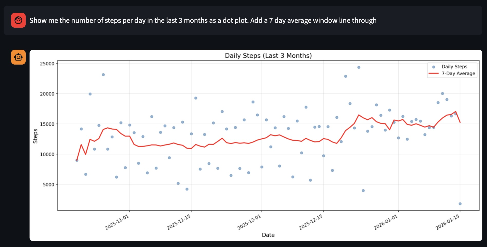

# Health Data Analysis Dashboard

<div align="center">



**Ask questions about your health data and get instant visualizations**

*Example: "Show me the number of steps per day in the last 3 months as a dot plot. Add a 7 day average window line through"*

</div>

---

Interactive Streamlit dashboard for analyzing Apple Health export data using natural language queries powered by Claude AI. Ask questions about any health data in your export and get instant visualizations or text answers.

**Key Features:**
- Zero configuration required - just point to your zip file
- Automatic data processing with checkpointing for large exports
- All files saved relative to your data location (not in the repo)
- AI-powered natural language queries
- Automatic plot saving with timestamps

## Features

- 🤖 **AI-Powered Analysis**: Natural language queries powered by Claude AI
- 📊 **Interactive Visualizations**: Generate plots and charts on the fly
- 💬 **Chat Interface**: Conversational interface for asking questions about your health data
- 📁 **All Health Data**: Supports all data types from Apple Health exports
- ⚡ **Automatic Setup**: Just select your zip file and everything is handled automatically
- 🎯 **Simple Workflow**: One command to run, no configuration needed

## Setup

### 1. Install Dependencies

```bash
pip install -r requirements.txt
```

### 2. Configure API Key

Create a `.env` file in the project root with your Anthropic API key:

```
ANTHROPIC_API_KEY=your_api_key_here
```

### 3. Export Your Health Data

<div align="center">


*Navigate to Settings → Privacy & Security → Health → Export Health Data*

</div>

1. On your iPhone, go to **Settings** → **Privacy & Security** → **Health** → **Export Health Data**
2. Save the zip file to a folder on your computer

## Usage

### Run the Dashboard

That's it! Just run:

```bash
streamlit run app.py
```

### First Time Setup

1. When you first run the app, you'll see instructions for selecting your zip file
2. **Get the file path:**
   - On macOS: Open Finder, locate your zip file, right-click while holding Option (⌥), then click "Copy as Pathname"
   - On Windows: Right-click the file, hold Shift, then click "Copy as path"
   - On Linux: Right-click the file and copy the path, or use `realpath filename.zip`
3. Paste the path into the text field and press Enter
4. The app will automatically:
   - Extract the zip file
   - Process all health data
   - Create a cache for fast loading
   - Create an output folder for any generated files

### Using the Dashboard

Once your data is loaded, simply ask questions in the chat interface:

**Text Questions:**
- "What's my average step count?"
- "How many days of data do I have?"
- "What's my average heart rate?"

**Visualization Requests:**
- "Show me a graph of my step count over time"
- "Create a plot of my sleep duration"
- "Plot my heart rate distribution"
- "Show my workout frequency by type"

**Date Filtering:**
- "Show me data from the last 6 months"
- "Filter to 2024 only"
- "What was my average steps in January?"

## Project Structure

```
health/
├── app.py                 # Main Streamlit dashboard
├── health_data/           # Core package
│   ├── __init__.py
│   ├── cache.py          # Data caching and loading
│   ├── checkpoint.py     # Incremental checkpointing
│   ├── claude_client.py  # Claude API client
│   ├── code_executor.py  # Safe code execution
│   ├── config.py         # Configuration management
│   ├── prompts.py        # Prompt templates
│   └── zip_handler.py    # Zip file extraction
├── config.json.example   # Example configuration (optional)
├── requirements.txt      # Python dependencies
├── .gitignore           # Git ignore rules
└── README.md
```

## How It Works

1. **Enter Zip File Path**: Paste the full path to your Apple Health export zip file
2. **Auto-Extraction**: The zip is automatically extracted to a folder next to the zip file
3. **Auto-Caching**: All health data is processed and cached in the same folder as the zip (with checkpointing for resumability)
4. **Auto-Output**: An "output" folder is created in the same location for any generated visualizations
5. **Chat Interface**: Start asking questions and getting insights! All plots are automatically saved to the output folder

## Data Organization

When you provide a zip file path, the app creates this structure in the same folder as your zip file:

```
your-folder/
├── your_export.zip                    # Your original zip file
├── apple_health_export/               # Extracted files
│   └── export.xml                    # Health data XML
├── all_health_data.pkl               # Cached processed data
├── checkpoints/                      # Processing checkpoints (for resuming)
│   ├── metadata.json
│   ├── records.pkl
│   └── dataframes/
└── output/                            # Generated visualizations
    └── *.png                          # All plots are saved here automatically
```

**Important**: All files are saved relative to your zip file location, not in the repository directory.

## Supported Data Types

The dashboard supports **all** data types from Apple Health exports, including:
- Steps, distance, flights climbed
- Heart rate, heart rate variability
- Sleep analysis (all stages)
- Workouts (all types)
- Active energy, basal energy
- Blood pressure, blood glucose
- And many more...

## Troubleshooting

**Can't find the file path:**
- On macOS: Use Finder's "Copy as Pathname" option (right-click + Option key)
- On Windows: Use "Copy as path" (right-click + Shift key)
- On Linux: Use `realpath filename.zip` in terminal or copy from file manager

**Cache not found:**
- Make sure you've selected the zip file at least once
- The cache is created in the same folder as your zip file
- If you move the zip file, you'll need to select it again

**API errors:**
- Verify your `ANTHROPIC_API_KEY` is set in `.env`
- Check that the model name in `config.json` is valid (if you've customized it)

**Import errors:**
- Make sure all dependencies are installed: `pip install -r requirements.txt`
- Check that you're using Python 3.8+

## Configuration (Optional)

By default, the app works with zero configuration. However, you can customize settings by creating a `config.json` file (copy from `config.json.example`):

- **Claude Model**: Which AI model to use (default: `claude-opus-4-5`)
- **Dashboard Settings**: Title, icon, layout

You can also override the Claude model via environment variable:
```bash
export CLAUDE_MODEL=claude-3-5-sonnet-20240620
```

## License

MIT License - feel free to use and modify as needed.
